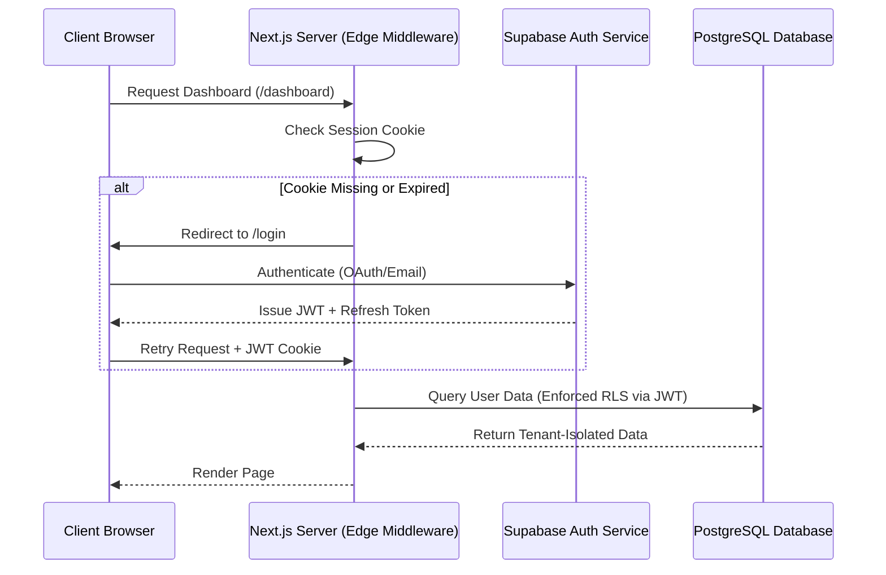

# Future-Ready Authentication & Authorization Architecture

This document defines the architectural blueprint and migration path for introducing a production-grade, multi-tenant, Role-Based Access Control (RBAC) authentication and authorization system into the Chronos platform.

---

## 1. Authentication Engine (Supabase Auth / NextAuth.js)

We recommend utilizing **Supabase Auth** as the primary authentication engine due to its native PostgreSQL Row-Level Security (RLS) integration, Edge-readiness, and built-in session management.

### Architectural Flow



---

## 2. Multi-Tenant Data Isolation (Row-Level Security)

To support millions of users securely, data must be strictly isolated at the database level. We will enable PostgreSQL Row-Level Security (RLS) on all tables related to workspaces.

### RLS Policies Configuration

```sql
-- Enable RLS on core tables
ALTER TABLE "Project" ENABLE ROW LEVEL SECURITY;
ALTER TABLE "Task" ENABLE ROW LEVEL SECURITY;
ALTER TABLE "TimeEntry" ENABLE ROW LEVEL SECURITY;

-- Create policy for Workspace members
CREATE POLICY workspace_isolation_policy ON "Project"
    FOR ALL
    USING (
        workspace_id IN (
            SELECT id FROM "Workspace" 
            WHERE owner_id = auth.uid()
        )
    );
```

---

## 3. Role-Based Access Control (RBAC)

We will introduce a `Role` enum and a `Member` table to allow workspace owners to invite collaborators with specific permissions.

### Database Schema Expansion

```prisma
enum WorkspaceRole {
  OWNER
  ADMIN
  MEMBER
  GUEST
}

model WorkspaceMember {
  id          String        @id @default(cuid())
  workspaceId String
  userId      String
  role        WorkspaceRole @default(MEMBER)
  createdAt   DateTime      @default(now())

  workspace   Workspace     @relation(fields: [workspaceId], references: [id], onDelete: Cascade)
  user        User          @relation(fields: [userId], references: [id], onDelete: Cascade)

  @@unique([workspaceId, userId])
}
```

### Permissions Matrix

| Permission | Guest | Member | Admin | Owner |
| :--- | :---: | :---: | :---: | :---: |
| Read Tasks / Projects | ✓ | ✓ | ✓ | ✓ |
| Create / Edit Tasks | ✗ | ✓ | ✓ | ✓ |
| Log Time Entries | ✓ | ✓ | ✓ | ✓ |
| Manage Project Settings | ✗ | ✗ | ✓ | ✓ |
| Invite / Remove Members | ✗ | ✗ | ✓ | ✓ |
| Delete Workspace | ✗ | ✗ | ✗ | ✓ |

---

## 4. Multi-Factor Authentication (MFA)

To comply with enterprise security requirements, MFA will be supported via Time-based One-Time Passwords (TOTP).

* **Enrollment**: Users generate a TOTP secret, scanned via QR code into authenticator apps (Google Authenticator, 1Password).
* **Verification**: Upon entering correct email/password, a secondary screen prompts for the 6-digit TOTP token.
* **Backup Codes**: Provide 8-10 static recovery codes for emergency account access.

---

## 5. Security & Session Hardening

* **Session Tokens**: JWTs stored in `__Host-` prefixed, `HttpOnly`, `Secure`, `SameSite=Lax` cookies to prevent Cross-Site Scripting (XSS) and Cross-Site Request Forgery (CSRF) attacks.
* **Token Rotation**: Implement automatic refresh token rotation (RTR) to detect and mitigate token theft.
* **Session Revocation**: Database-backed session tracking allowing users to "Sign out of all active devices".
